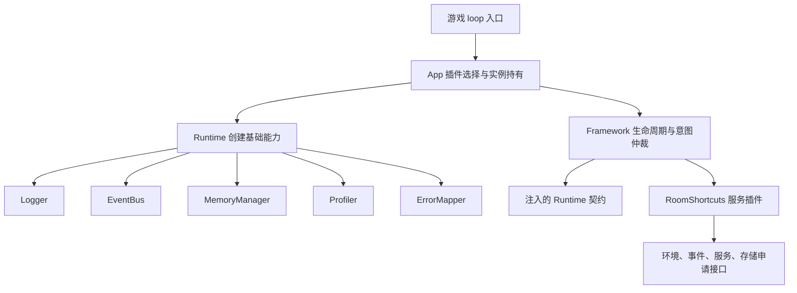

# Screeps Leviathan 系统审计报告

- 审计日期：2026-09-19
- 代码基线：`1b5cff3`（`master`，审计开始时工作区干净）
- 设计补充审阅：2026-09-19，依据 [goto 审阅后设计](../design/modules/goto.md)；设计文件 SHA-256：`d642c28f5b63188ed0511d441313defc51d62aa19da8575395c2dbc5b40a4cd7`
- 项目版本：`0.0.22`
- 审计方式：源码及设计审阅、自动化验证、依赖漏洞查询、覆盖率采集、独立故障复现
- 交付性质：问题记录与改进建议；本次未修复业务代码，未升级依赖，未上传游戏服务器
- 导航：[文档总导航](../README.md) · [审计索引](./README.md) · [结构化证据](./evidence/2026-09-19-results.json)

> 证据边界：代码审计、缺陷复现、源码统计和测试数据仍以 `1b5cff3` 为基线。goto 的交付状态、技术路线与后续计划按上述设计快照更新；旧类型及成本场文档已移除，新模块仍未实现。该次设计补充审阅没有重跑运行时测试或依赖扫描，原结构化证据保留原值；不能把设计结论当作实现验证。历史调整见 [更新记录](../changelog/2026-09-19.md)。

> P1 整改跟踪：A01/A02 已由 `1cd7b99` 修复并新增回归；A03 已移除宿主旧引擎依赖、启用隔离执行，根扫描为 0，隔离 runner 的 42 项上游风险仍开放。详见 [P1 整改记录](./2026-09-19-p1-remediation.md)及其独立验证证据。下文基线发现保留，不将历史扫描改写为当前结果。

## 1. 执行摘要

项目已经建立较清晰的 TypeScript 插件运行框架：公共契约独立、Runtime 集中创建基础能力、Framework 管理生命周期、MemoryManager 统一存储入口。单元测试、真实构建产物验证和本地 Screeps 引擎测试均能运行，错误隔离、依赖注入、意图仲裁和数据版本管理已有较扎实的实现。

**基线审计结论：适合继续开展受控开发，但持久化迁移尚不宜承载不能丢失的关键业务数据。** 本次在所有既有测试通过的情况下，独立复现了两项高优先级数据安全缺陷：

1. 迁移中止时可能清空外来 Segment 内容；配置变化后甚至可能写入管理范围之外的页面。
2. global reset 后，尚在迁移中的分区提前返回 `ready`，期间接受的修改会在目录切换后丢失。

代码基线中的应用只装配 RoomShortcuts 查询服务，没有采矿、孵化、物流、升级等完整经营流程。不能把“框架可连续执行”解释为“AI 已能长期自主经营”。goto 的新方案已形成设计，工厂、公共类型、运行时和测试均未交付。技术路线为原生房间路由与 PathFinder 搜索、AB/ABC 矩阵、按目标共享的压缩方向缓存，以及按工作状态响应的两 tick 避让。

**goto 设计评估：适合作为后续实现依据，但未获得正确性或性能验收结论。** 仅有向房间权重持久化，其余状态使用闭包 heap，降低了存储恢复范围；方向表合并和失效、跨房编码、owner 提交时序及单边移动失败仍是首要验证事项。原自建搜索、完整流场和残差复用不再列为开发路线。

另外，开发依赖审计报告 42 个风险项；生产依赖扫描为 0。前者主要来自本地引擎及其旧构建链，需按开发机与 CI 的实际暴露面治理，不能直接等同于游戏运行代码存在 42 个可利用漏洞。

建议顺序为：**修复迁移数据安全 → 补全恢复与工程保障 → 分阶段实现 goto 新设计并验证引擎边界 → 交付最小经营能力 → 按实测调整缓存与预算。** 本次更新仍只涉及报告，不授权实施模块或扩大功能范围。

## 2. 范围、方法与判断标准

### 2.1 审计范围

| 范围 | 本次检查内容 |
| --- | --- |
| 应用与公共契约 | 入口、插件装配、配置所有权、类型边界、调用契约 |
| Core | Runtime、Framework、CPU 检查、插件注册、意图仲裁、EventBus、Logger、ErrorMapper、Profiler、MemoryManager |
| 业务与工具 | 基线中的 RoomShortcuts、goto 旧类型/设计、优先队列、控制台格式化与 HTML 资源；本轮补充审阅 goto 新设计 |
| 工程与安全 | 构建、上传工具、依赖锁定、安装脚本、密钥路径、测试、静态边界检查、文档导航 |
| 运行特性 | 每 tick 成本、内存缓存、序列化、失败恢复、global reset、Segment 激活与迁移 |

在代码基线 `1b5cff3` 中，`src/` 共 63 个文件，8,445 行文本，包含注释、声明和 HTML；行数不是有效业务代码量。审计覆盖源码模块，但不声称证明所有输入和状态组合的正确性。

### 2.2 方法

- 将实现与 `AGENTS.md`、contracts、模块设计和使用说明相互核对。
- 运行现有类型检查、测试与构建，另行采集覆盖率和 `--strict` 诊断。
- 对迁移恢复构造可序列化的中间状态，在普通对象模拟的平台上执行真实 MemoryManager 实现。
- 查询 npm 漏洞数据库，区分全部依赖与 `--omit=dev` 结果，不执行自动修复。
- 对技术路线建议核对 Screeps、TypeScript 官方资料；算法与性能建议区分可证明条件和待测假设。

本轮补充审阅只核对 goto 的公开契约、存储范围、矩阵及路径缓存、不变量、框架阶段和避让时序，并修订相关风险和开发计划。第 4 节的测试数字与证据文件不作重新采集；设计风险单列于 §7.2，不混入已确认实现缺陷数量。

### 2.3 分级与置信度

| 优先级 | 含义 |
| --- | --- |
| P0 | 当前常规路径出现广泛不可恢复破坏或已确认的紧急安全事件；本次未确认此类事项 |
| P1 | 在明确条件下可能丢失/破坏数据，或开发环境存在需优先治理的高风险依赖 |
| P2 | 可靠性、规模、协议或验证存在实质缺口；应在扩展业务前安排 |
| P3 | 暂未进入主要运行路径的质量问题或工程便利性改进 |

置信度另行标注为“已复现”“静态确认”“条件风险”或“验证缺口”。优先级不是漏洞数据库严重度，也不是缺陷发生概率。

### 2.4 边界与未执行项目

没有访问真实游戏存储、执行外部部署、发动远端安全测试或评估真实账户经济表现；没有重新安装全部依赖。没有进行完整历史密钥内容扫描、许可证法律审查、依赖签名验证和第三方源码安全审计。未读取或在报告中记录凭据。

本地引擎的 Segment 激活行为与正式服务器存在已知差异；本次真实引擎测试通过，不能替代正式环境对激活延迟、容量异常和硬 CPU 中止的核验。详见[集成环境边界](../testing/integration.md)。

## 3. 系统概况与已具备的控制措施



图中的 Runtime 契约由前述装配结果实现；Framework 不重新创建这些基础实例。

值得保留的做法：

- [contracts](../../src/contracts/) 以类型约定跨模块协作；[Runtime](../../src/core/runtime/createRuntime.ts) 是明确的 Core 组合位置。
- [Framework](../../src/core/framework/createFramework.ts) 对同 tick 重复 loop、重入、依赖失败和钩子异常有处理；注册命令在候选表验证后应用。
- [IntentBroker](../../src/core/framework/intentBroker.ts) 先确定全部胜者再执行，避免动作异常改变同轮竞争结果；回执与下一 tick 事实核验分开。
- [MemoryAccessor](../../src/contracts/memory.ts) 区分 `pending/ready`，禁止过期 ready 视图跨 tick 使用；存储写入失败保留待提交状态。
- [ErrorMapper](../../src/core/errorMapper/createErrorMapper.ts) 延迟加载 source map，并隔离报告、映射故障；[Profiler](../../src/core/profiler/createProfiler.ts) 保留同步业务返回值和异常。
- [Logger](../../src/core/logger/createLogging.ts) 关闭等级时提前返回，输出故障不向业务传播；[RoomShortcuts](../../src/capabilities/roomShortcuts/createRoomShortcuts.ts) 缓存 ID 而非跨 tick 游戏对象。
- 上传代码会回读核对目标模块；构建与部署入口有区分。公共配置示例与密钥文件分开保存。

这些控制降低了常见故障风险，但不消除第 5 节列出的状态组合缺陷。

## 4. 验证结果与证据

### 4.1 实际执行结果

以下均为原代码审计执行结果；不包含尚未实现的 goto 新方案。

| 检查 | 结果 | 解释 |
| --- | --- | --- |
| `npx tsc --noEmit` | 通过 | 使用仓库当前非 strict 配置 |
| `npm test` | 通过 | 12 个 Jest 套件、144 项测试；另有 4 项构建工具测试、2 项真实产物测试 |
| `env -u DEST npm run test:integration` | 通过 | 构建成功；global-reset、runtime、segments 三个场景通过 |
| 无密钥实际构建与运行 | 通过 | `frameworkBundle.test.mjs` 使用临时构建环境验证 |
| 覆盖率采集 | 通过 | 144 项 Jest 测试；结果见下表 |
| `npx tsc --noEmit --strict --pretty false` | 5 条诊断 | 1 条在 src、4 条在 test；只作探测，没有修改 tsconfig |
| `npm audit --json` | 返回风险报告 | 1 critical、15 high、21 moderate、5 low，共 42 项 |
| `npm audit --omit=dev --json` | 0 项 | 不是供应链绝对安全证明 |
| MemoryManager 独立复现 | 确认异常 | 外来页被清空、配置外页面被写入、恢复期间修改丢失 |
| 密钥路径检查 | 未发现跟踪 | `.secret.json` 未被 Git 跟踪，本地可见引用历史中该路径提交数为 0 |

测试第一次受沙箱回环监听限制报 `listen EPERM`，授权本地监听后全部通过；第一次 npm 查询受 DNS 限制，授权网络后取得结果。这两次环境失败不计作项目缺陷。上传工具单元测试中的“uploaded”文字来自模拟请求，没有实际外部上传。

环境：Node.js `v24.20.0`、npm `12.0.2`，使用现有 lockfile 和已安装依赖。实际产物大小：`main.js` 125,032 字节，`main.js.map` 373,082 字节。后者是本地产物大小，上传工具会处理 source map，不能直接视为网络上传体积；两者均不是 CPU 或 heap 测量值。

### 4.2 覆盖率

采集命令：

```bash
npx jest --runInBand --coverage --collectCoverageFrom='src/**/*.ts' \
  --coverageDirectory=/tmp/leviathan-audit-20260919/coverage \
  --coverageReporters=json-summary
```

| 文件/范围 | 行覆盖 | 分支覆盖 | 函数覆盖 |
| --- | ---: | ---: | ---: |
| 总体 | 87.01% | 84.02% | 82.30% |
| MemoryManager 主实现 | 92.02% | 85.74% | 100% |
| 主存储 namespace | 87.11% | 75.32% | 100% |
| Framework 主实现 | 91.54% | 85.60% | 91.66% |
| EventBus 主实现 | 97.18% | 83.87% | 100% |
| Profiler 主实现 | 93.47% | 85.00% | 100% |
| Runtime 主实现 | 100% | 100% | 100% |
| RoomShortcuts 主实现 | 65.32% | 74.68% | 42.85% |
| createForm / createHelp | 0% / 0% | 0% / 0% | 0% / 0% |

这是 Jest 对 TypeScript 文件的覆盖率，不包含所有 HTML 内联脚本行为，也不汇总额外 Node 产物测试与引擎场景。RoomShortcuts 的重复查询出口会拉低函数覆盖率，不应仅为百分比机械补测；迁移状态组合已经证明，高行覆盖仍可能遗漏数据丢失。

### 4.3 可复现证据

- [结构化结果](./evidence/2026-09-19-results.json)：基线完整 commit、覆盖率、strict 诊断、依赖风险节点与建议修复版本、复现观测值。
- [MemoryManager 复现脚本](./evidence/2026-09-19-memory-reproduction.cjs)：使用项目 TypeScript 加载真实实现，仅操作模拟存储。

从仓库根运行：

```bash
node docs/audits/evidence/2026-09-19-memory-reproduction.cjs
```

基线输出中的关键事实：

```text
目标页 0：foreign-data → 空字符串，发生 writeSegment(0, '')
仅管理页 0，但迁移指向页 99：发生 writeSegment(99, '')
恢复 verify 阶段：access() 返回 ready
提交 n=2，完成迁移后再重建管理器：读取 n=1
```

脚本是本次审计的观察工具，不是合格行为断言。修复后输出应变化，并应把“不得发生这些行为”加入正式测试。

## 5. 审计发现与整改建议

### 5.1 问题清单

| 编号 | 优先级 | 性质 | 问题 | 建议完成门槛 |
| --- | --- | --- | --- | --- |
| A01 | P1 | 已复现 | 迁移中止清空外来或配置外 Segment | 关键分区使用 Segment 前 |
| A02 | P1 | 已复现 | reset 恢复未保持冻结，写入随后丢失 | 关键持久状态上线前 |
| A03 | P1 | 扫描确认、暴露面有条件 | 本地引擎依赖树含高危与严重风险项 | 同一修复迭代完成隔离与处置方案 |
| A04 | P2 | 静态确认 | 存储与 Core 边界自动检查存在漏检写法 | 新增 Core/持久化模块前 |
| A05 | P2 | 条件风险 | 房间索引依赖事件，但应用未装配事件生产者 | 将缓存用于关键经营判断前 |
| A06 | P2 | 条件风险 | 长生命周期缓存缺少总量限制与回收策略 | 大规模插件/房间运行前 |
| A07 | P2 | 静态确认；部分已处理 | 文档与正文注释存在旧协议，模块文档不齐；goto 旧协议项已移除 | 下一模块开发前 |
| A08 | P2 | 验证缺口 | 恢复组合测试与自动化执行保障不足 | 修复 A01/A02 时一并补足 |
| A09 | P2 | 验证缺口 | 缺少目标负载下 CPU、heap 与序列化基线 | 决定算法优化与扩大规模前 |
| A10 | P2 | 静态确认 | 严格类型检查未开启 | 基础契约继续扩张前 |
| A11 | P3 | 条件风险 | 控制台 HTML 工具的信任边界和交互验证不足 | 正式开放表单/帮助 API 前 |
| A12 | P3 | 静态确认 | 上传请求缺少显式超时与有限恢复策略 | 形成固定部署流程前 |

共 12 项：P1 3 项、P2 7 项、P3 2 项。A03 的 42 个依赖风险项不另计为 42 个项目缺陷；未交付业务模块属于产品成熟度，不作为缺陷凑数。

### A01：迁移失败清理可能破坏不属于本次迁移的数据

**整改状态：** 已修复，提交 `1cd7b99`；回归与剩余环境限制见 [P1 整改记录](./2026-09-19-p1-remediation.md)。以下为基线证据。

**证据：** [createMemoryManager.ts](../../src/core/memoryManager/createMemoryManager.ts) 的 `clearVacatedSegment`（约 L797）、`abortMigration`（L838）、copy 阶段目标检查（L1000–1048）。

**触发：** 恢复的 copy 记录指向非空目标页，或修改 `segmentIds` 后记录仍指向旧范围页面。copy 检测异常并中止，随后 `abortMigration` 只判断当前目录是否指向目标，没有证明该页由本次迁移写出。`clearVacatedSegment` 在页面可见时直接写空字符串。

**影响：** 外来内容被删除，且范围外页 99 的独立复现证明，前面的“非托管页面”检查不能约束后续清理副作用。不是只有恶意输入才可能触发；崩溃恢复、配置变更或页面被其他使用者占用均应被安全处理。

**建议：** 写入与清理都必须检查管理范围；清理前重新核验 owner、generation 与本次迁移关系，只有能证明归属的页面才可删除。异常页保留并报告，不能把“不属于当前目录”推导为“允许清空”。

**验收：** 外来文本、其他 owner、其他 generation、范围外页、无法读取页均不得收到清空写入；自己的中间副本仍可安全回收。覆盖 copy、verify 失败及重启恢复，而不仅检查首次分配时的外来页跳过。

### A02：迁移恢复期间提前 ready，已接受修改被旧页面覆盖

**整改状态：** 已修复，提交 `1cd7b99`；回归与剩余环境限制见 [P1 整改记录](./2026-09-19-p1-remediation.md)。以下为基线证据。

**证据：** 同一文件的 `restoreExistingPartition`（L584）、`begin`（L1220）、`freezeMoves`（L823）及 switch 更新（L1093 起）。

**触发：** 主存储带有 verify/switch 中间记录时重建管理器，业务重新申请该分区。恢复路径按旧目录装载数据，但没有在向业务发放访问视图前根据迁移记录冻结它。业务可提交 `n=2`；迁移继续使用已复制的 `n=1` 页面，切换时清除 resident 的 dirty 标记。

**影响：** 内存和实际页面内容分离，后续 global reset 恢复旧值，出现静默数据丢失。此处的 `commit` 本来就不承诺同步落盘，但管理器不能在正常推进结束后把修改当作已完成处理并无提示丢弃。

**建议：** 在 begin/申请恢复阶段根据迁移记录建立冻结状态；copy、verify、switch 状态必须在业务访问前生效。不要用“页暂不可见”等等待原因覆盖迁移冻结语义；重新申请、版本升级及延迟申请也应遵守同一规则。

**验收：** 每个迁移阶段分别执行“重建管理器 → 重新申请 → 尝试修改 → 完成迁移 → 再重建”的时间线；冻结期只返回 pending，解除后修改必须可恢复。加入页面短暂不可见和 Raw 写失败组合。

### A03：开发依赖树存在高风险旧依赖

**整改状态：** 已完成依赖树拆分、受限容器与处置清单；根扫描为 0，隔离 runner 仍有 42 项上游风险，残余保持开放。边界及复查时间见 [P1 整改记录](./2026-09-19-p1-remediation.md)。以下扫描为原基线。

**证据：** 本次 npm 结果及 [package-lock.json](../../package-lock.json)。42 项中包含 1 critical、15 high。严重项的 lodash 节点来自 Screeps backend/common/driver/engine/launcher/storage 等嵌套路径，锁定版本为 `3.10.1`；根 lodash 为 `4.18.1`，不能混为同一依赖节点。示例公告见 [GHSA-fvqr-27wr-82fm](https://github.com/advisories/GHSA-fvqr-27wr-82fm)。

**影响边界：** 生产依赖扫描为 0；旧组件位于开发/集成链。本地场景不启动完整 backend，但安装脚本、测试进程和依赖所处理的输入仍属于开发机/CI 风险面。本次未证明具体漏洞在本项目输入下可利用。

**建议：** 使用隔离测试环境，不把开发引擎对公网开放，不向测试作业提供生产凭据；逐项确认调用可达性及上游兼容版本。npm 给部分路径的修复建议是将集成包从 3.0.0 改为 2.0.0，不能直接执行 `audit fix --force`。npm 的修复建议还可能改变安装树，需单独验证。[npm audit 官方说明](https://docs.npmjs.com/cli/v11/commands/npm-audit/)

**验收：** 形成风险处置表（节点、可达性、隔离措施、升级或接受理由），对升级候选执行全部本地引擎场景。对暂不能消除的风险保留明确记录与复查日期。

### A04：架构边界检查不是完整的静态保障

**证据：** [memoryBoundary.test.ts](../../test/memoryBoundary.test.ts) 编译后用正则识别几种写法；`const store = Memory; store.jobs = []`、`globalThis['Memory']` 等不在当前模式内。[coreDependencyBoundary.test.ts](../../test/coreDependencyBoundary.test.ts) 只遍历顶层 import/export；`@/core` 总入口、动态 import/require、间接转发不被完整解析。

**影响：** 本次扫描和已审阅源码没有确认实际越界实现，但后续修改可能在违反强制边界时仍通过测试。它们是开发防错措施，不是恶意插件隔离机制。

**建议与验收：** 使用已有 TypeScript AST/符号解析加强检查，覆盖全局符号别名、下标访问、再导出及动态加载；增加正反例，避免把类型声明或字符串中的名称误报。不要为这一任务先引入额外运行时依赖。

### A05：RoomShortcuts 的事件增量更新在应用中尚无完整来源

**证据：** [app/modules.ts](../../src/app/modules.ts) 只注册 RoomShortcuts；[查询实现](../../src/capabilities/roomShortcuts/createRoomShortcuts.ts) 订阅建筑事件，并以默认 5000 tick 租期补偿漏事件。没有已装配的世界事件生产插件。

**影响：** 没有其他发布者时，新建筑可能直到再次触发租期重扫才进入列表；对象消失可被 ID 查询过滤，但新对象不会凭空进入索引。不能把这份索引当作每 tick 完整世界事实。静态观察未构造实际服务器建筑事件端到端场景。

**建议：** 对关键查询明确新鲜度要求；优先提供事件生产与验证，或采用预算受控的周期核对。单例列表首 ID 失效、视野变化、新建建筑、漏事件都应有针对性测试。

**验收：** 在事件正常、遗漏和重复三种情况下，定义并验证查询最大延迟；关键经营动作能在缓存尚未刷新时做事实复核。

goto 新设计要求按可见事实核验结构，不能直接把 RoomShortcuts 的租期缓存当作 ABC 矩阵的新鲜度证明。A05 的修复可改善共享观察能力，但 goto 正确性不能依赖尚未装配的事件来源。

### A06：若使用规模持续增长，缓存缺少统一容量边界

**证据：** [Framework](../../src/core/framework/createFramework.ts) 的 `healthTable`、`wrappers` 按插件 ID/标签增长；[Profiler](../../src/core/profiler/createProfiler.ts) 的 `usedLabel` 不随 reset 清理标签；RoomShortcuts 的房间索引主要在被访问并发现失效时删除。ErrorMapper 的 `capture` 截断输入，但公开 `mapStack` 本身不限制输入文本长度。

**影响：** 动态插件 ID、按任务 ID 生成计时标签、大量只访问一次的房间或直接传入巨型堆栈，可能增加 heap。当前应用只有固定服务插件，未证明已出现内存增长故障。

**建议：** 先明确 ID/标签应稳定且数量有限；对确需动态创建的部分定义删除、容量和观测指标。保留健康历史与回收之间需要明确语义，不应未经评估直接清表。对 mapStack 独立入口统一长度政策。

**验收：** 多轮注册/卸载、多房间访问后容器规模收敛到约定范围；确认 reset 不破坏已创建包装函数的统计语义。

### A07：文档和正文注释仍存在旧协议

**证据：**

- `1b5cff3:docs/design/modules/goto.md` §13 使用 `context.persistence`，而实际存储入口为 `context.memory`。
- [Framework 设计 §4.1](../design/core/framework.md) 仍写首次 loop 创建默认 Profiler，与 Runtime 创建职责不符。
- [app/modules.ts](../../src/app/modules.ts) 正文把 manifest.version 解释为 Memory schema 版本，而 contracts 区分插件版本与分区数据版本。
- [总导航](../README.md) 已承认 EventBus、RoomShortcuts 使用说明、App 和 utils 的独立设计/使用文档缺口。

**影响：** 开发者可能按过期示例接入存储、错误理解迁移触发条件；头部摘要改善并没有自动解决正文与文档一致性。

**本轮状态：** goto 的旧设计及类型已移除；新设计明确通过 `context.memory` 仅持久化有向房间权重，因此本项中的 goto 旧存储协议问题已在文档层处理。Framework 正文、应用注释及其他模块文档缺口未在本轮修复，A07 整体仍未关闭。新 goto 的运行时边界还需在实现后验证。

**建议与验收：** 对照公共协议修订设计意图和示例，补齐真实已交付模块的双文档；未交付 goto 不编造使用说明。设计只写意图和交付标记，历史差异留在 changelog，审计对照保留在本报告。

### A08：恢复验证及持续执行保障不足

**证据：** MemoryManager 单元测试较多，但 A01/A02 在 92.02% 行覆盖下仍能复现。本地引擎场景未覆盖真实插件分区迁移的完整状态组合；[测试文档](../testing/integration.md) 明确说明相关模拟限制。仓库未发现已跟踪的 CI 工作流配置；不据此断言外部平台没有自动化。

**建议：** 建立“迁移阶段 × global reset × 重新申请 × 写失败 × 页面可见性”的风险矩阵，以数据不丢、外来页不写、冻结期不发 ready 为不变量。把类型、边界检查、单元与产物测试加入持续验证；原生引擎测试单独隔离运行。

**验收：** A01/A02 的正式回归断言失败于审计基线、通过于修复版本；故障组合可重复执行。固定 Node/npm、使用 npm ci，安装脚本授权清单有审阅记录。正式服务器复核需另行明确部署授权。

### A09：尚无业务规模下的长期性能与稳定性基线

**证据：** 引擎 runtime 场景运行 4 tick，其他场景侧重恢复与存储语义。没有交付多房间、多插件、多意图的长期 CPU/heap 报表。MemoryManager 的序列化与迁移在 end 中同步完成；框架的保留 CPU 只是准入阈值，不保证这些工作一定能完成。

**需重点测量：** 插件排序反复扫描与排序候选；意图排序和反复递归检查传递依赖；命名空间分片 JSON 与整串拼接；大量标签 report 排序；多个房间索引在相近 tick 到期重建。它们是潜在开销点，不是本次已确认的 CPU 超限。

**建议与验收：** 建立冷启动、稳定期、集中失效、低 bucket、迁移、故障日志六类基准；记录 CPU 中位数/P95/P99、bucket 趋势、可用时的 heap 统计、序列化字符数、分区等待 tick。基准应包含无 Profiler、开启 Profiler 两组，避免测量开销混入业务结论。

goto 补充基准应覆盖 AB/ABC 构建与局部更新、依赖校验、方向合并、整 goal 集中失效、原生搜索和策略回调的总成本；同时记录方向表有效格比例与单边避让失败。只报 search CPU 或 1250 字节数组大小，会遗漏主要维护开销。详细验收见 §7.2、§8.2。

### A10：严格类型检查未开启，但迁移成本看起来可控

**证据：** [tsconfig.json](../../tsconfig.json) 未启用 strict；本次临时开启仅得到 5 条诊断：源码中一次 Map 首键可能为 undefined，测试中空数组泛型推导、undefined 参数和可选 memory 方法调用。

**建议：** 将 strict 作为独立小任务完成，不借此重构无关业务；先修复五处诊断，再设置持续检查。`noUncheckedIndexedAccess` 可随后单独评估，不能从本次 5 条推断其成本也相同。严格检查的作用见 [TypeScript strict](https://www.typescriptlang.org/tsconfig/strict) 与 [noUncheckedIndexedAccess](https://www.typescriptlang.org/tsconfig/noUncheckedIndexedAccess.html)。

**验收：** 严格检查通过，不靠大量 any、非空断言或关闭检查掩盖缺口；默认构建与现有测试继续通过。

### A11：控制台 HTML 工具应在开放前明确输入信任边界

**证据：** [utils.ts](../../src/utils/console/utils.ts) 不做 HTML 转义，模板替换使用正则和替换字符串；[表单模板](../../src/utils/console/form/template.html) 将命令与字段写入脚本，单个 checkbox 不走多选数组分支；DOM 名称和帮助 ID 使用名称加 Game.time。同 tick 同名生成可能冲突。两个渲染器在本次 Jest 采集下覆盖率为 0。

**影响：** 如果把不可信文本作为 HTML、属性或脚本输入，存在注入风险；checkbox 单项及 ID 重复可能影响交互。本次没有在浏览器中验证利用过程，且表单/帮助尚未从公共 console 入口开放。

**建议与验收：** 区分纯文本、HTML、属性和可执行命令，按上下文处理编码；命令只接收开发者受信定义。补测特殊字符、单个/多个 checkbox、同 tick 重复渲染，再决定是否公开 API。

### A12：上传工具缺少显式请求超时

**证据：** [rollupPlugins.mjs](../../build/rollupPlugins.mjs) 的 request 使用 fetch，但未设置超时 signal；HTTP/body 校验和上传后回读已有实现。

**影响：** 网络或服务迟迟不响应时可能长时间占用部署进程；上传已成功但回读失败时，操作者无法仅凭退出状态判断远端最终版本。单元测试模拟 HTTP，不等于正式服务端到端验证。

**建议与验收：** 加有限超时，区分写入前失败、写入结果不确定、回读失败；只对可安全重试步骤采用有限重试，不能无条件重复写操作。保持凭据不进日志，并测试超时、非 JSON、部分返回和回读不一致。

## 6. 常规审计综合评价

| 维度 | 评价与保留条件 |
| --- | --- |
| 架构与模块职责 | 组合根和契约分离值得保留；自动边界检查还需加强，不能作为完整隔离证明 |
| 功能正确性 | 基础生命周期与仲裁已有验证；迁移恢复存在已复现缺陷；goto 新方案仅完成设计，移动和经营能力尚未交付 |
| 数据完整性与恢复 | 分区、代次、版本、迁移记录方向合理；A01/A02 关闭前不应把该实现视为关键数据保障 |
| 安全与供应链 | 未发现跟踪密钥路径；开发依赖有风险，HTML 输入和部署网络需定义信任范围 |
| CPU 与内存 | 已交付模块使用按需加载等手段；goto 明确 heap 容量和版本边界，但尚无实现测量；不能给出性能达标结论 |
| 测试与工程 | 现有本地验证全部可运行；覆盖率较高，但组合故障、持续检查和真实线上语义仍有缺口 |
| 可维护性 | 源文件摘要较完整，超长 MemoryManager 和 Framework 需要依靠状态不变量及测试辅助维护；不建议立即按文件行数机械拆分 |
| 交付与运维 | 构建不依赖凭据、上传有回读；缺少正式发布/回退演练和长期运行观测 |
| 文档与合规记录 | 导航公开标记缺项是优点；旧协议必须清理。package 声明 ISC，但本次不作完整许可证合规结论 |

威胁模型以可信开发者编写的插件为前提：contracts、阶段检查与日志异常隔离主要防止误用，不提供第三方恶意插件沙箱。持久数据应视为可能陈旧或损坏，不能因为来自自己的历史版本就跳过归属与状态验证。

## 7. 各模块技术路线选型评估与建议（新增专题）

已交付模块建议以代码审计基线为前提；goto 专节依据文首所列设计快照。分别标注实现事实、设计选择与待验证条件，没有实测收益的替代方案不作为立即重构理由。

### 7.1 已交付模块

| 模块 | 技术路线与适合之处 | 代价/替代路线比较 | 建议与采用条件 |
| --- | --- | --- | --- |
| App / 游戏入口 | 工厂创建一次、跨 tick 持有实例，插件描述决定装配 | 比全局对象散布更易测试；应用只有服务查询，不能代替经营逻辑 | **保留**；新增能力通过插件 setup 接入，禁止在模块加载时读取游戏状态 |
| contracts / 全局类型 | TypeScript 结构化接口、判别联合、事件名与载荷关联 | 编译期成本低；运行时未知输入仍要验证，宽化的全局 RoomObject ID 声明不能保证实际对象都有 ID | **补强** strict；逐步缩小确需 `_HasId` 的对象约束，不急于引入 schema 库 |
| Runtime | 显式单向组装、配置与实例替换分开 | 相较依赖注入容器没有反射/注册查找成本；需要手动维护装配次序 | **保留**；固定创建优先级、默认值和失败策略，避免引入通用容器 |
| Framework | 同步阶段循环、依赖排序、候选注册表、上下文复用 | 适合 tick 模型；无法抢占插件，依赖图检查有重复扫描成本 | **保留**；先加时间线不变量与规模测试，插件数上升后才考虑索引化拓扑排序 |
| CpuGovernor | 即时采样 Game.cpu，普通/关键任务分开准入 | 轻量，但阈值不等于 CPU 预留保证；大任务必须可分批 | **补强**基准与长任务预算协议；避免将同步计算简单改为 Promise，游戏 tick 并不会因此被安全分片 |
| IntentBroker | 全收集、稳定排序、对象通道与锁仲裁、集中执行 | 冲突解释清楚；O(n log n) 排序和依赖核验有成本，不处理数量型资源预留 | **保留**到业务压力出现；先定义动作通道规范，资源账本作为单独需求设计 |
| EventBus | 嵌套 Map、同步分发、监听器快照 | 快照便于定义重入增删语义；发布时有数组分配。队列式总线会改变阶段顺序 | **保留**同步语义；热点事件测量后再考虑快照复用，优先补事件来源和文档 |
| Logger | 作用域工厂、等级过滤、前缀缓存、输出异常隔离 | 简单可预测；集中故障仍可能高频输出。引入通用日志库收益有限 | **保留**；需要时增加相同错误的有限聚合，确保首次故障和恢复信息可见 |
| ErrorMapper | `@jridgewell/trace-mapping` 同步查询、延迟加载、有界条目缓存 | 适配同步 tick；source map 占用及直接 mapStack 大输入需约束。异步/WASM 路线增加初始化复杂度 | **保留**同步实现；统一入口长度约束，测一次冷加载成本，不急于换库 |
| Profiler | 包装同步函数、调用栈扣除子耗时、按标签累加 | 易定位自身耗时；测量本身有开销，不能观测未包装函数，标签可能增长 | **保留**轻量统计；稳定标签、采样/报告分离；MemoryAccessor 持久化未交付，不应隐式补写存储 |
| MemoryManager | Raw 目录与分区、固定 Segment、迁移记录、字符串片段缓存 | 能降低重复 stringify；显著增加恢复状态和跨后端一致性复杂度 | **先修复再扩展**；新业务默认无 priority 的 Raw 分区，先建立容量与 CPU 基线；高容量分区经测试后才申请 Segment |
| RoomShortcuts | 按需 room.find，缓存 ID，事件增量+租期核对 | 比逐次全房扫描便宜；新鲜度取决于事件和租期。每 tick 全量扫描更简单但成本更高 | **补强**事件生产、关键查询复核和增量核对预算；不要无差别缩短所有缓存租期 |
| PriorityQueue | 比较器驱动数组二叉堆，原地建堆 | 通用、实现小，push/pop O(log n)；共享输入数组、同优先级不稳定 | **保留**作基准。整数桶队列仅在权值范围和测量收益明确时替代 |
| console 格式化 | 纯字符串拼接、小型颜色工具 | 低依赖；原始 HTML 与普通文本混用容易出错 | **保留**基础工具但明确编码责任；不要为简单着色引入浏览器框架 |
| console 表单/帮助 | 构建期 HTML 字符串+内联 CSS/脚本 | 模板直观；依赖游戏页面 DOM/Angular，缺浏览器测试，命令嵌入风险高 | **暂不扩大公开范围**；开放前解决 A11，若只需少量配置，普通控制台函数是更低维护成本的选项 |
| 构建与测试工具 | Rollup 单文件 CJS、Jest、VM 产物测试、本地原生引擎 | 兼顾模块单测与实际产物；原生依赖多且含旧链路 | **保留分层测试**；隔离引擎环境，日常快速检查与较重引擎测试分开运行；暂无换打包器的证据 |

MemoryManager 的固定十页路线符合当前“同时激活页数有限”的模型，但会长期占用这一共享资源；如果未来要和其他 Segment 使用者共存，需要单独的激活协调协议。官方规定页面异步取得、下一 tick 可见、单页最大 100 KB；现有模拟器差异不能改写生产假设。[Screeps RawMemory API](https://docs.screeps.com/api/#RawMemory)

### 7.2 goto：原生搜索、共享方向与工作状态协作

**审阅对象与结论：** [goto 新设计](../design/modules/goto.md) 的 §1–12；该模块尚未实现。路线将复杂度集中在缓存一致性和移动协作，避免自行维护寻路算法，符合项目的 tick/heap 约束。建议按设计分阶段实施和验证，不能仅凭接口描述判定已优于直接原生搜索。

#### 7.2.1 技术选择评估

| 选择点 | 评估及代价 | 建议与采用条件 |
| --- | --- | --- |
| createGoto 工厂及 goto/hold/flush/plugin | 显式实例、owner 与阶段约束便于隔离；消费者必须拆分 begin 工作决策与 execute 提交 | **采用设计**；验证未 setup、重复登记、错 owner、未 flush、暂停及注销行为，避免 service 可见就误认为动作可提交 |
| Game.map.findRoute + PathFinder.search | 房间有向偏好和格子搜索分工清楚；逐跳入口选择与共享后缀不保证联合最短 | **采用设计**；Room.findPath 仅作便捷调用/对照，正式路径统一完成度和预算语义，不维护两套缓存适配 |
| 仅有向权重持久化 | A→B/B→A 独立，其他状态 heap 化缩小恢复面；但封禁规则丢失仍可能改变安全路线 | **采用设计**；受 A01/A02 的存储质量门槛约束，pending 时禁止依赖权重的跨房动作；applied 不解释为 durable |
| AB 基底 + ABC 一般矩阵 | 省去独立 C 矩阵；AB 无 TTL，d 覆盖及其搜索结果不入长期缓存 | **采用设计**；验证拆除时从 AB 恢复再叠加同格全部结构，版本只随内容变更，容量回收与有效期分开 |
| 所有非己方 rampart 禁行 | 降低公开通道突然关闭的风险，但会放弃原本可通行的公共路线 | **接受保守取舍**；使用说明必须明确该行为，不能把拒绝公共 rampart 报为引擎不可达证明 |
| goal/room 的 4 bit 方向表 | 无起点索引，能共享后缀；每房数组 1250 字节，但短路径利用率可能低 | **采用设计并测量**；0 为未知而非无路，到达 range 优先判断；预算包含 Map、版本、反向索引及待续搜索 |
| 只增补未知前缀，保留已知后缀 | 不需要逐格距离表；无环性依赖旧图连通目标、版本有效及无半写入 | **作为核心不变量验收**；完整原生路径才入库，合并失败不留部分方向，禁止任意覆盖已有出边 |
| 矩阵依赖变化整 goal 作废 | 简化跨房依赖和失效证明；某个热点房间变化可能连带废弃大量方向 | **先保留保守粒度**；同 tick 多次变化用单调版本，非沿途边权下降用全局路由版本；不以 TTL 替代正确性 |
| 双表记录移动尝试 | 常数时间轮换，天然筛选上 tick 原生 move 返回 OK 的 creep | **采用设计**；保存 from/expectedNext/creepId/tick，排除疲劳、名字复用、漏 end 和外部位置偏离 |
| 当 tick 应答、下一 tick 同步尝试 | 减少等待已腾空后再出发的延迟；允许进入计划释放格，存在单边执行风险 | **有条件采用**；双方重新登记并确认工作状态，commit 前检查提交/取消状态，真实引擎验证第三方抢位与单边失败 |
| 按 owner/role/state 直接选择策略 | 查找层数固定，工作约束与空间成本分开；用户回调仍可抛错或耗尽 CPU | **采用设计**；未刷新状态保守拒绝，generation/version 约束复用，异常隔离且不宣称可强制抢占同步策略 |

框架阶段核对依据为 [createFramework](../../src/core/framework/createFramework.ts) 和 [PluginContext](../../src/contracts/plugin.ts)：全部 begin 结束后进入 execute，commit 在 end 之前，submit 只允许所属插件 execute。新设计的 begin 收集、goto execute 规划、owner execute flush 与此相容；不能把“集中规划”改成 goto.onTickEnd 直接调用游戏动作。该结论是契约和调用顺序的静态核对，不是 goto 集成测试已经通过。

#### 7.2.2 设计风险与实现验收门槛

以下 G01–G06 是补充设计评估的风险编号，不作为已复现代码缺陷新增到 A01–A12。

| 编号 | 条件风险/验证缺口 | 必须提供的验收证据 |
| --- | --- | --- |
| G01：方向合并与依赖断裂 | 交叉路径覆盖、只删一个房间、旧后缀过期、同 tick 复用已核验标记，可能留下环或断链 | 构造多路径交叉/并入；验证每个非 0 方向最终到达目标；矩阵变化和局部淘汰导致整 goal 无效；失败入库无半成品；覆盖后房间变化 |
| G02：跨房编码与策略 | 局部 dx/dy、边界传送和入口重试容易混淆；房间白名单不能代表有向边约束 | 四方向及房名坐标边界的真实引擎场景；实际位置转换与编码一致；白名单捷径/反向边被拒；未完成结果不进入完整方向缓存 |
| G03：结构事实与保守通行 | 时间戳碰撞、热点首次未知、拆除未恢复、RoomShortcuts 陈旧索引或未知结构被当成新鲜事实 | 同 tick 两次内容更新版本不同；只观察不失效；road+b 成本不重复；同格多结构和 public rampart；失去/恢复视野时换版与拒绝/探索标记 |
| G04：阶段、owner 与双表 | 消费者 begin 后失败、execute 未 flush、漏 end、同名新 creep 可能污染计划/阻塞判断 | 调换消费者次序仍同 tick 应答；未提交不产生 move 记录；重复登记不重复调用；硬中断与非连续 tick 清理；关键行为不依赖 goto 冒用 owner |
| G05：协作不具原子性 | 双方提交后仍可能因框架失败、预算或引擎冲突只移动一方；工作状态可能已改变 | t 应答/t+1 双方尝试/t+2 位置核验；工作 generation 改变取消；单边移动后可恢复；窄道拒绝、拒绝冷却及固定矿位约束均有场景 |
| G06：容量与失效峰值 | 随机目标导致定长数组利用率低，整 goal 失效和后缀遍历可能抵消命中收益 | 冷启动/稳定/集中失效的总 CPU P50/P95/P99；方向有效格比例；所有元数据与待续任务有界；低预算时安全 deferred，不反复无界重算 |

这些风险中的防护已经写入设计，审计要求是实现并验证其前提，不能据此宣称设计已存在运行时缺陷或防护已生效。缓存不承诺全局最短，因此验收应比较政策遵守、可达性和结果恢复，并测量路径代价差异，不能要求与完整 Dijkstra 的每步选择完全相同。

#### 7.2.3 对其他审计事项的影响

- **A01/A02：** heap 缓存无需跨 global 恢复，但有向封禁/权重仍需要可靠持久化，数据安全问题未因范围缩小而关闭。存储修复前可以做不接生产存储的单元设计验证，不能宣称关键配置已可靠上线。
- **A05：** goto 按可见事实核验 ABC，不能继承 RoomShortcuts 的 5000 tick 新鲜度假设；可共享采集结果，但必须遵守 goto 的观察与版本边界。
- **A06/A09：** 缓存上限与指标已在设计规定，尚未有实现或负载数据证明收敛；需把构建、合并、检查、失效和策略调用计入总 CPU。
- **A07：** goto 的旧 persistence 协议已从活动设计移除，其他文档缺口继续整改；使用说明等运行时交付后再编写。

性能收益不能按“少一次同 tick move 就节省 0.2”估算。设计已依据官方驱动区分同对象同动作覆盖的计费去重与脚本调用成本；基准应测量最终移动意图数和总 CPU，尤其记录单边失败后未产生位移的动作。相关依据及接口比较见 [goto 设计 §2、§5](../design/modules/goto.md)。

## 8. 下一步开发计划（新增专题）

这是建议计划，不是本次审计的实施授权。工期按一名熟悉代码的开发者估算，包含测试与文档，属于可调整的工作量范围，不是承诺日期。修复顺序以数据安全和可验证性为先。

| 阶段 | 建议工作量 | 内容与产物 | 前置条件 | 验收标准 |
| --- | --- | --- | --- | --- |
| M0：持久化安全 | 3–5 人日 | 修复 A01/A02；补阶段恢复测试；A03 完成隔离及风险处置清单 | 无 | 复现反例转为正式回归；外来/配置外页面写入数为 0；冻结与恢复不变量通过 |
| M1：开发保障与协议 | 3–5 人日 | 加强边界检查、启用 strict、修正文档、建立持续验证；明确部署超时方案 | M0 的核心修复可验证 | 类型、边界、单元、产物测试稳定执行；不存在可调用示例使用旧 persistence 协议；依赖风险有责任人与复查日期 |
| M2：goto 分阶段交付 | 按 §8.2 拆分后估算 | 工厂/权重、AB/ABC、压缩方向、双表及策略协作、真实引擎与容量验证 | M0、M1；另行取得实现授权 | 各子阶段关闭 G01–G06 对应验收缺口；pending 不阻断房内独立行为；跨房与两 tick 避让有事实证据 |
| M3：最小经营闭环 | 5–10 人日 | 孵化、采集、搬运、补能、升级的最小插件组合及重启恢复 | M2；单独确认业务目标 | 在本地场景维持约定的经营周期；单位死亡、低能量、reset 后可继续；所有动作经意图规则处理 |
| M4：规模与缓存调优 | 3–6 人日验证阶段 | A06/A09 长期观测；同目标与随机目标对照；调整缓存容量、重建/搜索预算、失效批量与策略成本 | 有 M2/M3 的真实调用分布 | 有可重跑基准；正确性不退化；CPU/heap 收益达到预先约定门槛；方向压缩作为 M2 既定结构测量，不重复列为待选算法 |

M2 按新设计包含五个交付阶段，不沿用旧移动原型的 5–8 人日估算；待跨房适配和真实引擎验收用例拆解后再定工作量。M4 的 3–6 人日仅为测量与调优决策估算，不包含额外功能。上游依赖升级成本另行评估。

### 8.1 M0 的建议实施顺序

1. 把本报告复现转换为失败测试，固定代码基线和存储快照。
2. 收紧所有迁移清理的归属和管理范围校验，验证中止路径。
3. 在业务访问之前恢复迁移冻结，覆盖晚申请、页缺失、版本迁移与 Raw 写失败。
4. 执行完整现有验证，再跑故障矩阵；保留失败现场与可重放快照。
5. 通过后再安排验证环境的真实 Segment 演练，上传需单独授权。

### 8.2 M2 的分阶段开发计划

| 子阶段 | 交付内容 | 关键验收与依赖 |
| --- | --- | --- |
| M2a：工厂、生命周期与权重 | createGoto、服务/plugin、goto/hold/flush、权重 CRUD、批次版本、pending/reset | 先确认 begin/execute 接入与 owner 规则；测试错阶段、重复登记、暂停和未 flush；仅有向权重使用 context.memory。生产持久化依赖 M0 |
| M2b：房间观察与矩阵 | AB 基底、ABC 合成/局部修补、内容版本、按需 d、区域配置及预算 | M2a；关闭 G03，覆盖 road/profile/b 合成、拆除与同格结构、全部非己方 rampart 禁行；不依赖未交付事件源 |
| M2c：原生路径与方向缓存 | 原生路线/分段搜索、goalKey、4 bit 表、无环增补、整 goal 失效、待续任务 | M2b；关闭 G01/G02；单房、跨房、未完成、0 格、目标 range、非沿途边变便宜及版本淘汰；真实引擎核验出口转换 |
| M2d：移动协作与工作策略 | 双表、请求去重/冷却、同 tick 应答、次 tick 配对尝试、状态策略与预约 | M2c；关闭 G04/G05；消费者排序互换、工作取消、固定矿位拒绝、第三方抢位、单边失败和漏 end；真实引擎确认结算 |
| M2e：规模、恢复与文档 | 压力场景、容量限制、global reset、诊断指标、默认参数和使用说明 | M2a–d；验证 G06；收集总 CPU/heap 与缓存维护成本，所有配置和公共返回契约对齐 |

每阶段是可独立审阅的交付单元，不表示第一阶段就已经支持完整跨房/避让能力。测试应按真实不变量组织，不以模拟器返回固定 OK 代替位置核验。A05 的共享观察治理可独立推进，goto 自身必须先提供足够新鲜的结构事实。

### 8.3 进入关键业务前的质量门槛

- A01/A02 关闭；关键分区的恢复、初始化和版本迁移契约有测试。
- 未就绪分区只暂停依赖该分区的行为；业务仍可执行不依赖持久化的安全动作。
- 原型级基准先运行至少 1000 个模拟 tick；实际服务器运行窗口、CPU 与 heap 上限按可用环境另行约定。1000 tick 是建议门槛，不是本次已完成验证。
- 先记录基线，再约定 P95/P99 预算、待写积压和缓存容量；没有测量前不设置貌似精确的性能承诺。
- goto 的 G01–G06 必须有逐项验收记录；通过全部既有测试不代表新方向缓存或协作协议已经验证。
- 设计、使用说明、测试与类型接口一致；每次交付记录范围和未覆盖事项。

### 8.4 暂不建议优先投入

不重新引入 goto 自建 A*、完整流场、残差复用或自定义搜索队列，也不把矩阵和路径缓存迁入 Segment；这些均不属于已审阅的新设计。4 bit 方向表和两 tick 避让已纳入 M2，按阶段完成，不能当作无关的可选优化删去。

在数据恢复和经营基线形成前，不优先引入通用依赖注入框架、替换打包器、全面重写 Framework 或对所有数据做二进制压缩。交换/推挤链、跨 shard 等新移动能力须另行设计和确认。

## 9. 审计限制、残余风险与复查方式

本报告包含对固定代码提交的工程审计，以及对文首 goto 设计快照的补充评估。设计修改没有改变原测试基线，也没有验证任何尚未实现的接口；报告不是形式化证明，不保证未列出的问题不存在。特别是：

- 依赖公告随时间变化，升级前应重新查询；0 个生产依赖风险项不包含宿主提供的全部组件安全性。
- 覆盖率不是故障组合覆盖度，也不是正式服务器的长期可靠性指标；原 144 项 Jest 测试不包含 goto 新功能的验收。
- goto 的性能、跨房编码和两 tick 协作仍需实测；框架没有跨 owner 原子动作组，单边失败属于必须处理的残余风险。
- Segment 官方语义与模拟环境差异、引擎硬 CPU 中止以及多后端持久化顺序，仍需独立环境验证。
- 缓存增长、CPU 热点与 HTML 利用风险中部分结论是条件风险，尚未发生目标负载实测或浏览器利用验证。
- 本次只核验密钥路径是否被跟踪，不应将此表述为“历史中不存在任何凭据”。

复查建议：M0 完成后针对数据安全做一次专项复审；M2 每子阶段对照设计快照和 G01–G06 复审，M2/M3 完成后按实际调用规模重测性能、缓存与事件新鲜度；依赖树变更后重跑安全扫描和原生引擎场景。每项关闭记录应包含修复提交、验证命令、结果和剩余限制。
